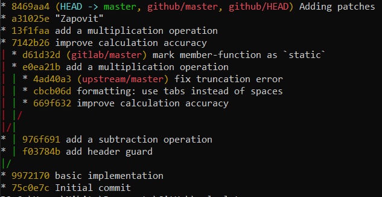

# AK2_LAB1

## Граф:



## Лістинг:

### calcalator.cpp

```cpp
#include "calculator.h"

int Calculator::Add (double a, double b)
{
    return a + b + 0.5;
}

int Calculator::Sub (double a, double b)
{
    return Add (a, -b);
}

int Calculator::Mul (double a, double b)
{
    return a * b + 0.5;
}
 /*
 Як умру, то поховайте
Мене на могилі,
Серед степу широкого,
На Вкраїні милій,
Щоб лани широкополі,
І Дніпро, і кручі
Було видно, було чути,
Як реве ревучий.
Як понесе з України
У синєє море
Кров ворожу... отойді я
І лани, і гори —
Все покину і полину
До самого бога
Молитися... а до того
Я не знаю бога.
Поховайте та вставайте,
Кайдани порвіте
І вражою злою кров'ю
Волю окропіте.
І мене в сем'ї великій,
В сем'ї вольній, новій,
Не забудьте пом'янути
Незлим тихим словом.
*/
```
### calculator.h

```cpp
#ifndef CALCULATOR_H
#define CALCULATOR_H

class Calculator
{
    public:
<<<<<<< HEAD
        int Add (double, double);
        int Sub (double, double);
=======
        int Add (int, int);
        int Mul (double, double);
>>>>>>> e0ea21b... add a multiplication operation
};

#endif//CALCULATOR_H

```
## Патчі: 

### 0001-fix-truncation-error-swapped.patch

```
From faf9675c4c1e097ca5b0d605d5c6d5dbaf8c6d0d Mon Sep 17 00:00:00 2001
From: Sergii Piatakov <sergii.piatakov@globallogic.com>
Date: Thu, 15 Nov 2018 15:28:04 +0200
Subject: [PATCH 1/2] fix truncation error(swapped)

To convert float to integer the truncation is performed, but the
rounding is expected.

Test: Add (4.9, 4.9) should return 10.
Signed-off-by: Nikita Pinchuk
---
 calculator.cpp | 2 +-
 1 file changed, 1 insertion(+), 1 deletion(-)

diff --git a/calculator.cpp b/calculator.cpp
index b91afea..498f7b9 100644
--- a/calculator.cpp
+++ b/calculator.cpp
@@ -2,7 +2,7 @@
 
 int Calculator::Add (double a, double b)
 {
-    return a + b;
+    return a + b + 0.5;
 }
 
 int Calculator::Sub (double a, double b)
-- 
2.28.0.windows.1
```
### 0002-formatting-use-tabs-instead-of-spaces-swapped.patch

```
From 9eeb64dc5c30ea92ffeaada9011ef2cdc15f63bf Mon Sep 17 00:00:00 2001
From: Sergii Piatakov <sergii.piatakov@globallogic.com>
Date: Thu, 15 Nov 2018 15:26:35 +0200
Subject: [PATCH 2/2] formatting: use tabs instead of spaces(swapped)

Signed-off-by: Nikita Pinchuk
---
 calculator.cpp | 2 +-
 calculator.h   | 6 +++---
 2 files changed, 4 insertions(+), 4 deletions(-)

diff --git a/calculator.cpp b/calculator.cpp
index 498f7b9..67cc638 100644
--- a/calculator.cpp
+++ b/calculator.cpp
@@ -7,5 +7,5 @@ int Calculator::Add (double a, double b)
 
 int Calculator::Sub (double a, double b)
 {
-    return Add (a, -b);
+	return Add (a, -b);
 }
diff --git a/calculator.h b/calculator.h
index 3740907..d59d596 100644
--- a/calculator.h
+++ b/calculator.h
@@ -3,9 +3,9 @@
 
 class Calculator
 {
-    public:
-        int Add (double, double);
-        int Sub (double, double);
+	public:
+		int Add (double, double);
+		int Sub (double, double);
 };
 
 #endif//CALCULATOR_H
-- 
2.28.0.windows.1
```
